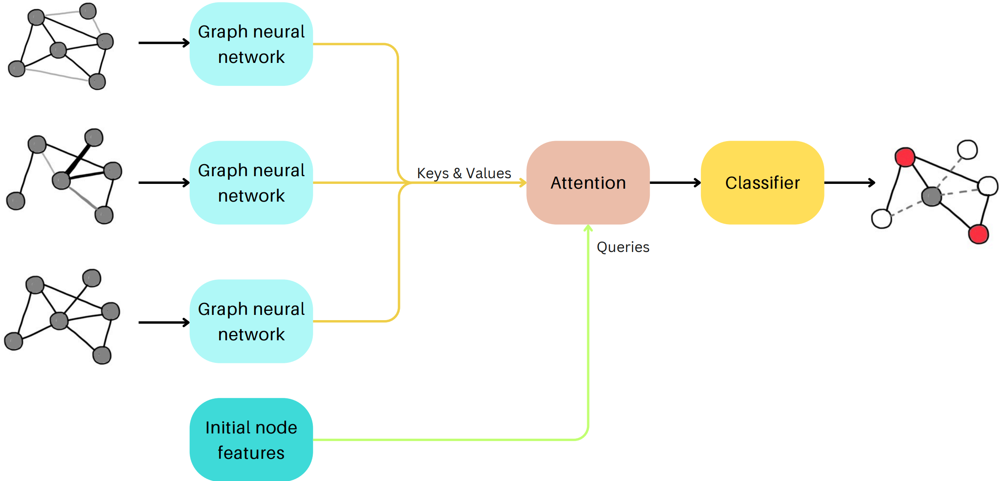

# Self Attending Edges



## Project overview

Detecting anomalies in graph-structured data is a crucial task for preventing cyber fraud, including fake reviews and bank scams, which can have significant financial repercussions. This project introduces a novel architecture that leverages Graph Neural Networks (GNNs) to enhance anomaly detection in graphs, providing a robust solution to these challenges.

Our method offers significant improvements in detecting fraudulent activities, thereby enhancing data integrity and maintaining consumer trust. The ability to accurately detect anomalies in graph-structured data can help organizations prevent various forms of cyber fraud, safeguarding financial interests and upholding the credibility of digital platforms.

Additional information from the project is provided on the project [report](https://github.com/joanlafuente/SAE/blob/main/Images/report.pdf).

<!-- ## Application overview 
Aixo no se si cal o no aqui pero bueno com ho hem deescriure pel report ho podriem possar -->

## Data
We use two graphs provided by [CARE-GNN repository](https://github.com/YingtongDou/CARE-GNN?tab=readme-ov-file). 

### Amazon graph
This [graph](https://paperswithcode.com/dataset/amazon-fraud) is based on amazon users that have done reviews on the instrument category in amazon. Users are nodes in the graph, and there are three types of relations, which are:
  1. **U-P-U** : it connects users reviewing at least one same product
  2. **U-S-U** : it connects users having at least one same star rating within one week
  3. **U-V-U** : it connects users with top 5% mutual review text similarities (measured by TF-IDF) among all users.
     
Users with more than 80% helpful votes are labelled as benign entities and users with less than 20% helpful votes are labelled as fraudulent entities.


### YelpChi graph
This [graph](https://paperswithcode.com/dataset/yelpchi)  is based on reviews done in Yelp. In this case reviews are the nodes and there are three types of relations, which are:
  1. **R-U-R**: it connects reviews posted by the same user;
  2. **R-S-R**: it connects reviews under the same product with the same star rating (1-5 stars);
  3. **R-T-R**: it connects two reviews under the same product posted in the same month.
     
Reviews considered spam are the anomalous nodes.

## Repository Structure

```sh
# YelpChi and Amazon reviews datasets
/Data

# Store the configuration files of the different experiments
# There is a folder inside for each approach
./Setups/
    Autoencoder/                # Experiments related to Autoencoders 
    ML/                         # Machine learning experiments
    SelfSupervisedContrastive/  # Self-supervision related experiments
    Supervised/                 # Supervised classification experiments
    SupervisedContrastive/      # Supervised contrastive learning experiments

# The results of the experiments are automatically saved here,
# each approach is saved in a different folder.
./Runs/
    Autoencoder/ 
    ML/ 
    SelfSupervisedContrastive/ 
    Supervised/ 
    SupervisedContrastive/ 

# Script in which the models are defined
/models.py
# Script with functions used on several files
/utils.py

# Files to train the a model using the different approaches
/train_autoencoder.py                   <= Using a Node or Edge autoencoer  
/train_contrastive_selfsupervisedV2.py  <= Using other self-supervised methods
/train_contrastive_supervisedV2.py      <= Using triplet loss
/train_supervised_learningV2.py         <= Using Cross entropy loss (It can also use at the same time the triplet loss)
/train_ml.py                            <= Using classical machine learning methods

# To train a classifier based on a gaussian mixture model
/GMMClassifier.py
# To train a classifer based on findding a treshold on a single feature
/TresholdClassifier.py
# To train a ML classifier on top of the trained model embeddings
/SVMClassifier.py

# Script to generate the predictions for a previously trained model
/gen_predictions.py
# Script for visualizing the self-attention module of our proposed solution
/self_attention_visualitzation.py

./Utils/
    data_process.py                         # Data preprocesing required for the graphs
    EDA.ipynb                               # Exploratory data analysis
    gen_plot_different_train_percentage.py  # Generate a plot of the performance of the model given a percentage of the data used to train 
    Statistics_Amazon.ipynb                 # Basic statistics and some ML models for Amazon data 
    Statistics_Yelp.ipynb                   # Basic statistics and some ML models for Yelp data

# Srcipts used to start the training with sbatch
/bash_scripts

# All the code related to The Spotter web app
/The_Spotter
```

## Installation and Usage

Before starting clone the repository:

```
git clone https://github.com/joanlafuente/StorIA.git
```
And then create a conda environment with the following command:
```
conda env create -f environment.yml
```

This enviroment will contain all the necesary dependecies to use the code on the repository.

Finally, unzip ``/Data/Graphs.zip`` file on ``/Data`` folder, to have the data prepared and be able to execute the code in the repository.

### Training models on our pipeline
The first step is to create a .yaml file with the desired model, approach and data configuration on the corresponding approach file. There are several examples of our experiments in the setups folder. Once this step is done the training proccedure is lunched in the same way for all deep learning approaches.

An example for a supervised classifier:
```sh
python3 train_supervised_learningV2.py NameYaml
```
It will automatically go to the folder of Setups for supervised learning and load the yaml configuration file, then it will create a folder on ``Runs/Supervised`` with the name of the ``.yaml`` file in which the results of the experiment will be saved. It works in the same way for the rest of approaches.


### Incorporating additional models
In order to train some additional model to the ones provided it must be added to ``./models.py``, and the imported in the desired approach training file. Once this step has been done it also requires to add a condition when initzilizing the model in that specific file. This conditions must be added to the if-elseif chain that you will see. Now you can see an example of how must be done:

```sh
elif params["model_name"] == 'Name Assigned to the model for the .yaml files':
    model = ModelClassName(**params['model'])
```

### Executing The Spotter
Using the web app is straightforward. Navigate to The Spotter folder and execute the app.py file inside the folder using the following command line. 
```sh
cd ./The_Spotter/
python3 app.py
```
This will yield an HTTP address in the console, by clicking in this address it will execute the app in a web browser in a new tab.


## Contributors
Joan Lafuente, joan.lafuente@autonoma.cat

Maiol Sabater, maiol.sabater@autonoma.cat

Neil de la Fuente,

Daniel Vidal, 


Anomaly detection on graphs project for synthesis-project subject 2024. 
